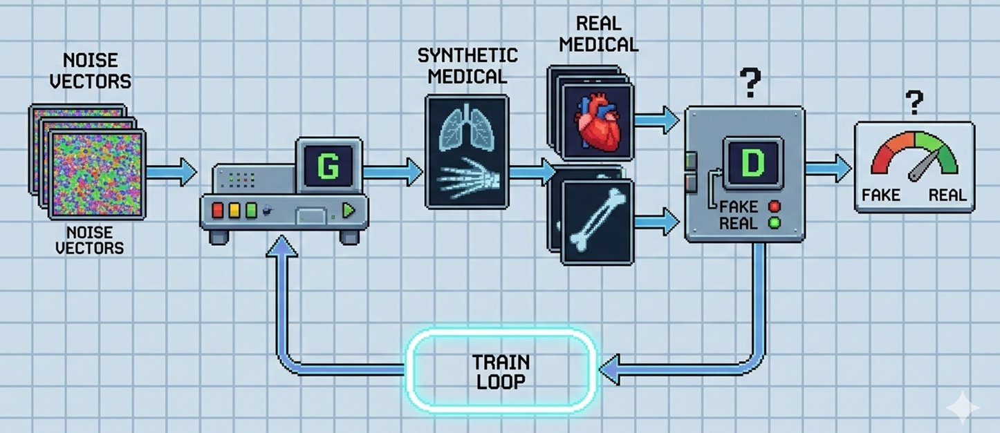
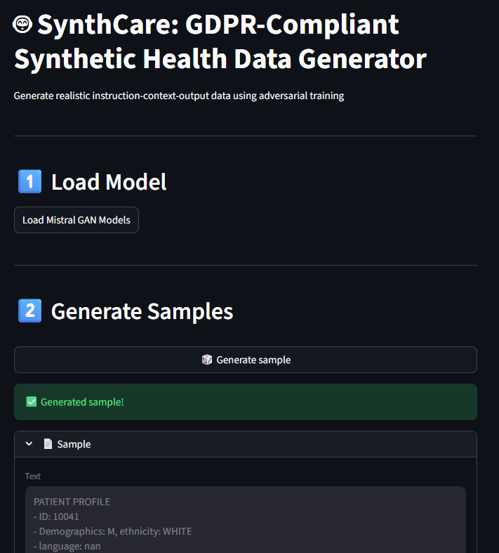

# SynthCare: GDPR-Compliant Synthetic Health Data Generator
A GAN-based solution for generating synthetic emergency health admission datasets, enabling public data sharing without violating GDPR.

## 📌 Overview
SynthCare is a Generative Adversarial Network (GAN) designed to generate realistic, synthetic emergency health admission datasets. The goal is to provide a GDPR-compliant alternative to real patient data, allowing researchers, hospitals, and AI developers to:

- Train models on realistic but anonymized data 
- Models are trained locally to ensure data privacy.
- Avoid legal risks associated with real patient data under GDPR.
- Share datasets publicly for collaborative research and AI development.
- Trained on urgency admission medical sheets => => [MIMIC-III](https://physionet.org/content/mimic3-carevue/1.4/)

This project was developed as part of [Mistral Worldwide Hacks](https://worldwide-hackathon.mistral.ai/) and focuses on automatic health admission files in emergency departments.

## 🔍 Problem Statement

Real health data is highly sensitive and subject to strict GDPR regulations.
Sharing real patient data publicly is legally risky and often impossible.
Researchers and AI developers need realistic datasets to train models for emergency health admission systems.
Solution: Use a GAN to generate synthetic data that mimics real distributions but contains no real patient information.

## ⚡ Features

- GAN-based synthetic data generation using [Ministral-3](https://huggingface.co/mistralai/Ministral-3-3B-Instruct-2512) LLMS for multimodal data
- GDPR compliance: No real patient data is exposed.
- Realistic distributions: Synthetic data matches statistical properties of real emergency admission files.
- Customizable: Adaptable to different health data schemas.
- Open-source: Free to use, modify, and extend.

But most importantely, it can be adapted to all kind of private or sensible informations worth enough to be shared.

## GAN architecture

## Streamlit UI 
